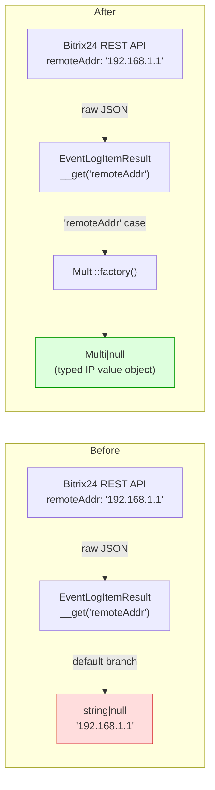
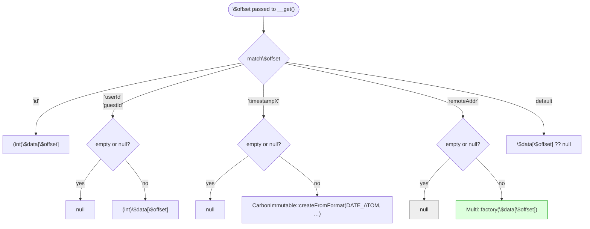
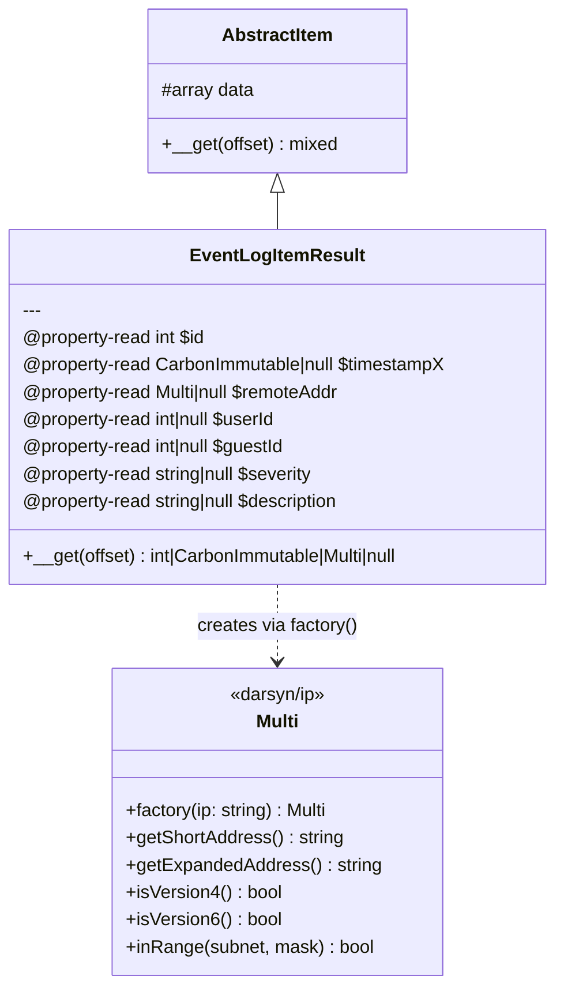
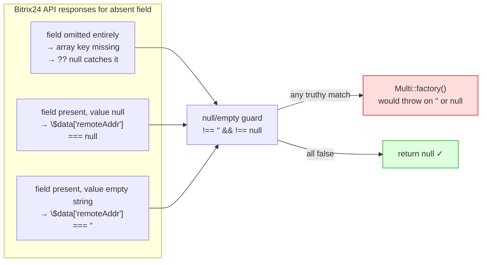

# Plan: Type `remoteAddr` as `Darsyn\IP\Version\Multi` in `EventLogItemResult`

## Context

The `remoteAddr` field in `EventLogItemResult` currently returns a raw `string|null`.
`darsyn/ip` (`"^4 || ^5 || ^6"`) is **already** a `composer.json` dependency but unused in result items.
Using `Darsyn\IP\Version\Multi` provides a typed IP value object that auto-detects IPv4/IPv6,
enabling range checks, CIDR lookups, and protocol-appropriate string representation instead of raw strings.

---

## Data flow: before → after



---

## `__get()` dispatch logic



---

## Class relationship



---

## Null-guard: why both `!== ''` and `!== null`?



---

## Files to modify

### 1. `src/Services/Main/Result/EventLogItemResult.php`

**Add import:**
```php
use Darsyn\IP\Version\Multi;
```

**Update `@property-read` annotation:**
```php
- * @property-read string|null          $remoteAddr
+ * @property-read Multi|null           $remoteAddr
```

**Add `remoteAddr` case in `__get()` match:**
```php
'remoteAddr' => ($this->data[$offset] !== '' && $this->data[$offset] !== null)
    ? Multi::factory($this->data[$offset])
    : null,
```

Full updated match:
```php
return match ($offset) {
    'id' => (int)$this->data[$offset],
    'userId', 'guestId' => ($this->data[$offset] !== null && $this->data[$offset] !== '')
        ? (int)$this->data[$offset]
        : null,
    'timestampX' => ($this->data[$offset] !== '' && $this->data[$offset] !== null)
        ? CarbonImmutable::createFromFormat(DATE_ATOM, $this->data[$offset])
        : null,
    'remoteAddr' => ($this->data[$offset] !== '' && $this->data[$offset] !== null)
        ? Multi::factory($this->data[$offset])
        : null,
    default => $this->data[$offset] ?? null,
};
```

---

### 2. `tests/Integration/Services/Main/Service/EventLogTest.php`

Update `testGet()`: add `->remoteAddr()` to the select builder, add assertion:
```php
$eventLogItemResult = $this->eventLog->get(
    $id,
    (new EventLogSelectBuilder())
        ->timestampX()
        ->severity()
        ->auditTypeId()
        ->moduleId()
        ->userId()
        ->remoteAddr()          // ← add
        ->description()
)->eventLogItem();

$this->assertSame($id, $eventLogItemResult->id);
$this->assertInstanceOf(CarbonImmutable::class, $eventLogItemResult->timestampX);
$this->assertIsString($eventLogItemResult->severity);
// ← add:
if ($eventLogItemResult->remoteAddr !== null) {
    $this->assertInstanceOf(Multi::class, $eventLogItemResult->remoteAddr);
}
```

Add import at the top of the test file:
```php
use Darsyn\IP\Version\Multi;
```

---

## Critical reference files

| File | Purpose |
|------|---------|
| `src/Services/Main/Result/EventLogItemResult.php` | File to modify |
| `tests/Integration/Services/Main/Service/EventLogTest.php` | Integration test to update |
| `vendor/darsyn/ip/src/Version/Multi.php` | `Multi::factory(string $ip)` — auto-detects IPv4/IPv6 |

---

## Verification

```bash
make test-unit                       # must pass (no unit test changes)
make lint-phpstan                    # no errors
make lint-cs-fixer                   # no style issues
make lint-rector                     # no rector suggestions
make test-integration-main-eventlog  # 4 tests pass, remoteAddr assertInstanceOf(Multi)
```
